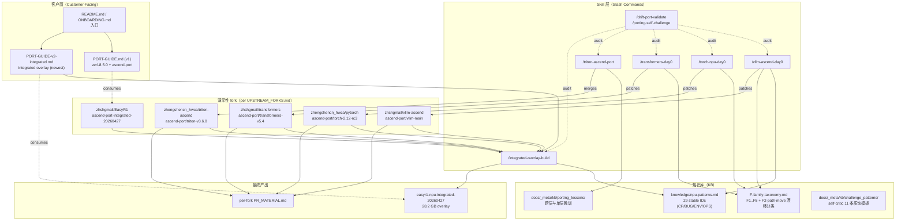
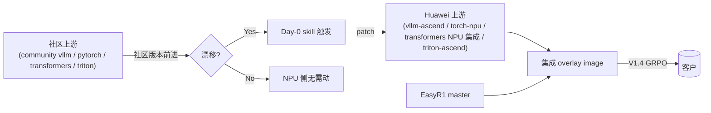
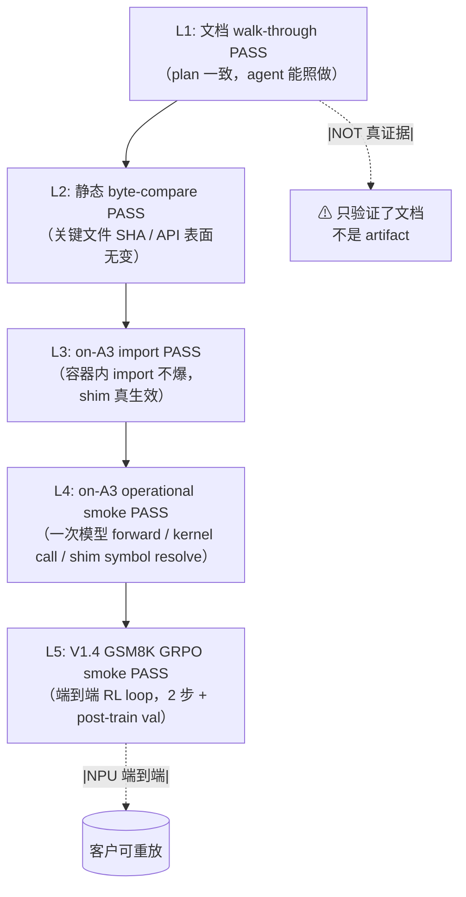

# 架构与流程 — easyr1-npu

> 本仓的整体架构、组件分工、以及"NPU 上游版本升级 → 集成验证 → 客户产出"的端到端流程。

---

## 1. 项目使命

把 [`hiyouga/EasyR1`](https://github.com/hiyouga/EasyR1) RL 框架适配到 Ascend 910C (A3) NPU，并沉淀一套**针对 4 个 NPU 上游**（vllm-ascend / torch-npu / transformers / triton-ascend）的可复用版本升级工具链。

**两件交付物**：

1. **可运行的 EasyR1**：在 A3 上 rollout + RL 训练。
2. **可复用 harness**：当上游版本前进时，自动扫描漂移、按模板修复、推到演示性 fork 分支、生成给上游维护者的 PR 资料包。

---

## 2. 整体架构



### 2.1 三层 vocabulary

| 层 | 含义 | 不可越俎代庖 |
|---|---|---|
| **Day-0 skill**（vllm-ascend / torch-npu / transformers） | 社区某上游放出新版本，对应 NPU 上游还没追上 → 写 forward-compat shim 把新版本接入 | 一次只动一个上游；不混编 |
| **Port skill**（triton-ascend） | 上游本身是 vendored fork（不是 plugin）→ git merge + 冲突解决，而不是 F1..F8 漂移扫描 | 不能用 F-family 模型 |
| **Integrated overlay**（`/integrated-overlay-build`） | 把 4 个 ascend-port 分支 + EasyR1 master 叠到一个已部署的 base image 上 → 一镜像跑通 V1.4 GRPO | 不在这里修单上游 bug；要修先回单上游 day-0 |

### 2.2 4 个 NPU 上游的关系



**关键边界**（写在 Day-0 skill ALWAYS_LOADED_RULES OL-08）：

- **可改**：Huawei 拥有的上游（vllm-ascend、torch-npu、transformers NPU 集成文件、triton-ascend）。
- **不可改**：社区 vllm / community pytorch / community transformers core / community triton。这些是 C-report only（写 blocker 报告，不动其源代码）。

---

## 3. 端到端流程

### 3.1 触发场景

Day-0 / Port skill 启动的典型触发：

| 触发 | 例 | 路由到 |
|---|---|---|
| 社区上游放出新版本，NPU 上游主线还没适配 | community vllm 0.21 RC | `/vllm-ascend-day0` |
| 现有镜像里 torch_npu 用的 torch 版本被新 EasyR1 要求升 | torch 2.11 → 2.12-rc3 | `/torch-npu-day0` |
| 上游 transformers 出新版本 | v5.4 → v5.6 | `/transformers-day0` |
| triton-ascend 要追社区 triton 新 tag | v3.5.0 → v3.6.0 | `/triton-ascend-port` |
| 新 base image 到位，要 ship 新 integrated 版本 | 任意一个上行变更 + 新 base | `/integrated-overlay-build` |

### 3.2 流程图

```mermaid
sequenceDiagram
    autonumber
    participant User as 工程师 / 上游维护者
    participant Day0 as Day-0 / Port skill<br/>(/vllm-ascend-day0 等)
    participant Sweep as 扫描脚本<br/>(sweep.sh / kb_drive_test.py)
    participant KB as KB<br/>(F-family / npu-patterns / lessons)
    participant Fork as 演示性 fork branch<br/>(ascend-port/&lt;target&gt;)
    participant Integ as /integrated-overlay-build
    participant A3 as A3 host<br/>(115.190.166.102)
    participant Image as easyr1-npu:integrated-&lt;DATE&gt;

    User->>Day0: 调用 slash command<br/>带 target version
    Day0->>Sweep: 扫漂移 (commit range)
    Sweep-->>Day0: F1..F8 + F2-path-move drifts
    Day0->>KB: 查 F-family fix template
    KB-->>Day0: shim 模板 + 历史案例
    Day0->>Fork: 写 shim + commit + push
    Fork-->>Day0: PR_MATERIAL.md ready

    Note over Day0,Fork: 至此单上游 day-0 完成<br/>给上游维护者用

    User->>Integ: 4 上游都 PASS 后调用
    Integ->>Fork: pull 4 个 ascend-port 分支
    Integ->>A3: docker build overlay
    A3-->>Image: 28.2 GB image
    Integ->>A3: 跑 V1.4 GRPO smoke
    A3-->>Integ: 2 step PASS + checkpoint
    Integ-->>User: image tag + smoke log + PR_MATERIAL
```

### 3.3 Outcome 分类（共享 vocabulary）

每条 Day-0 / Port skill 产出唯一的 outcome 标签：

| Outcome | 含义 | 客户能拿到的产出 |
|---|---|---|
| **A** | 新版本 byte-compatible / 集成面 0 漂移，不需改任何代码 | 一行 ONBOARDING note |
| **A-with-note** | A，但有 additive 变化值得记录（不影响现有路径） | A + 一段已知差异说明 |
| **B** | 1 行 sig wrapper / env var 即可解决 | 单 commit + 简短文档 |
| **C-patch** | 需在 NPU 上游写 forward-compat shim | fork branch + PR_MATERIAL.md，给上游维护者 |
| **C-report** | 修复在社区上游，不能动 → 写 blocker 报告，session 结束 | blocker.md + reproducer |

完整定义见 [`GLOSSARY.md`](GLOSSARY.md) 与 [`F-family-taxonomy.md`](../../src/skills/_shared/patterns/F-family-taxonomy.md)。

---

## 4. 仓库布局

```
~/workspace/easyr1-npu/
├── repo/                              # 本仓（github.com/zhshgmail/easyr1-npu）
│   ├── README.md                      # 项目入口
│   ├── ONBOARDING.md                  # 一页 quickstart（v1 + v2）
│   ├── CLAUDE.md                      # Claude Code 项目级 context
│   ├── docs/
│   │   ├── easyr1/                    # 客户面：怎么在 A3 上跑 EasyR1
│   │   ├── _meta/                     # 项目级权威文档
│   │   │   ├── ARCHITECTURE.md        # 本文档
│   │   │   ├── UPSTREAM_FORKS.md      # 4 fork + EasyR1 fork 的权威 ledger
│   │   │   ├── SKILLS-USAGE.md        # slash command 速查
│   │   │   ├── GLOSSARY.md            # 术语表
│   │   │   ├── DOCS-CONVENTION.md     # 文档组织 convention
│   │   │   └── kb/                    # 跨层教训 + self-critic 模板
│   │   ├── vllm-ascend/PORTING-GUIDE.md       # 给 vllm-ascend 维护者
│   │   ├── torch-npu/PORTING-GUIDE.md         # 给 torch-npu 维护者
│   │   ├── transformers/                      # transformers 维护者面 + PR 资料
│   │   └── _archive/                  # 已归档文档（不当前活跃）
│   ├── src/
│   │   ├── skills/                    # 5 类 skill：4 day-0/port + 1 integrated + 共享
│   │   └── scripts/                   # install-skills.sh, run-npu-container.sh, smoke 脚本
│   └── knowledge/
│       ├── npu-patterns.md            # 29 stable IDs：NPU-CP/BUG/ENV/OPS
│       └── upstream-refs.md           # 各 NPU 镜像里上游版本对照表
└── upstream/                          # 各上游本地 clone（每 dir 独立 git）
    ├── EasyR1/                        # 主目标
    ├── verl/                          # GPU 参考
    ├── torch-npu/ / transformers/ / vllm-ascend/ / triton-ascend/   # 4 NPU 上游
    └── pytorch/ / vllm/                                              # 4 上游对应的社区 repo（漂移扫描需要）
```

### 4.1 Skill 目录布局

```mermaid
graph LR
    Skills["src/skills/"]

    subgraph PerUpstream["按上游分目录"]
        VllmS["vllm-ascend/port-expert/<br/>SKILL.md (/vllm-ascend-day0)<br/>+ scripts/<br/>+ references/KB_INDEX.md"]
        TorchS["torch-npu/port-expert/<br/>(/torch-npu-day0)"]
        TransS["transformers/port-expert/<br/>(/transformers-day0)"]
        TritonS["triton-ascend/port-expert/<br/>(/triton-ascend-port)"]
    end

    subgraph Shared["_shared/"]
        InTeg["integrated-overlay-build/<br/>(/integrated-overlay-build)"]
        Patt["patterns/F-family-taxonomy.md"]
        Work["upstream-day0-workflow.md"]
        Self["porting-self-challenge/<br/>(/porting-self-challenge)"]
        Drift["drift-port-validate/<br/>(/drift-port-validate)"]
        Run["npu-container-runner/<br/>SKILL + scripts"]
    end

    Skills --> PerUpstream
    Skills --> Shared
    PerUpstream -.shared workflow + KB.-> Shared
```



---

## 5. 验证层级（smoke ladder）

每条 skill 在某个层级上声明 PASS。**层级递进**：低层 PASS 不代表高层 PASS，反过来高层 FAIL 也不代表锅在最高层。



权威定义见 [`docs/_meta/kb/porting_lessons/cross-layer-007-walk-through-is-not-real-run.md`](kb/porting_lessons/cross-layer-007-walk-through-is-not-real-run.md)。

---

## 6. 当前状态（2026-04-28）

| 上游 | Outcome | 验证级别 | 产出分支 |
|---|---|---|---|
| vllm-ascend | C-patch（3 shim） | L4（on-A3 import 3/3 PASS） | [`ascend-port/vllm-main`](https://github.com/zhshgmail/vllm-ascend/tree/ascend-port/vllm-main) |
| torch-npu | A（v2.12-rc3 outcome A，已加 13 个 defensive shim） | L4 | [`ascend-port/torch-2.12-rc3`](https://gitcode.com/zhengshencn_hwca/pytorch/tree/ascend-port/torch-2.12-rc3) |
| transformers | A-with-note（v5.4 / v5.6.2 byte-compat） | L2 | [`ascend-port/transformers-v5.4`](https://github.com/zhshgmail/transformers/tree/ascend-port/transformers-v5.4) |
| triton-ascend | C-patch（v3.6.0 9 drifts，源码合并完成） | L4（vendor wheel 6/6 PASS）；源码端到端 BLOCKED on bishengir LLVM-22 | [`ascend-port/triton-v3.6.0`](https://gitcode.com/zhengshencn_hwca/triton-ascend/tree/ascend-port/triton-v3.6.0) |
| EasyR1（consumer） | A | **L5 PASS**（V1.4 GRPO 2 步 + post-train val，T22.7 + T25.5 双重确认） | [`ascend-port-integrated-20260427`](https://github.com/zhshgmail/EasyR1/tree/ascend-port-integrated-20260427) |

集成 image：`easyr1-npu:integrated-20260427`（28.2 GB，SHA `044ba0b76183`）。

---

## 7. 责任边界

- **本仓产出**：演示性 fork 分支 + PR_MATERIAL.md + 集成 image。
- **正式 PR**：由对应上游仓的维护者基于这些分支提交到他们自己的官方仓库。本仓不替代上游 PR review 流程。
- **A3 host 维护**：`115.190.166.102:443`，每条工具链需要 A3 才能完成 L4/L5 验证。

---

## 见也

- [`README.md`](../../README.md) — 项目入口
- [`UPSTREAM_FORKS.md`](UPSTREAM_FORKS.md) — fork ledger 权威表
- [`NPU_ADAPTATION_GAP.md`](NPU_ADAPTATION_GAP.md) — 下一波 NPU 适配候选清单（档 B / 档 C 软件）
- [`SKILLS-USAGE.md`](SKILLS-USAGE.md) — slash command 速查
- [`GLOSSARY.md`](GLOSSARY.md) — 术语表
- [`DOCS-CONVENTION.md`](DOCS-CONVENTION.md) — 文档组织 convention
- [`docs/easyr1/PORT-GUIDE.md`](../easyr1/PORT-GUIDE.md) / [`PORT-GUIDE-v2-integrated.md`](../easyr1/PORT-GUIDE-v2-integrated.md) — 客户跑 EasyR1
- [`knowledge/npu-patterns.md`](../../knowledge/npu-patterns.md) — 29 stable-ID 知识库
