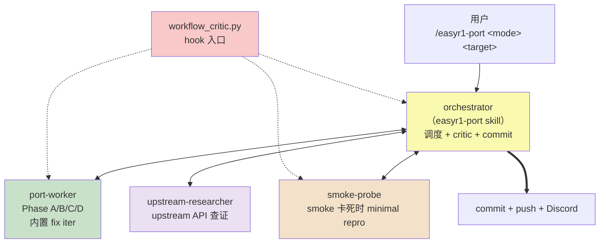
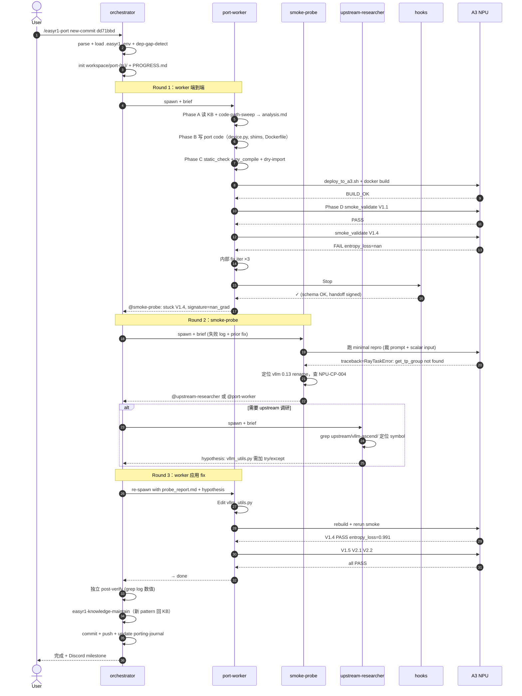

# easyr1-npu Skills 目标架构 + 演进路径 (V1.0 草案)

> 状态：2026-04-22，草稿 V1.0。为 Phase 实施之前的**设计评审**产出。
>
> 设计参考：`~/workspace/a5/a5_ops/docs/design/SKILLS_DESIGN.md`（V3.2）以及其引用的 `docs/workflow/opgen_state_machine.yaml` + `WORKFLOW_CRITIC_DESIGN.md`。我们借**模式**（4-agent + critic hook + state-machine YAML + KB 层次），不照抄 kernel-gen 语境。

---

## 0. 文档导航

本文 = **目标架构总体设计 + 演进路径**。新人先读本文。

具体细节拆到专门文档（未来各自独立）：

| Domain 文档 | 它拥有什么 | 当前状态 |
|---|---|---|
| `docs/workflow/port_state_machine.yaml` | 工作流 **canonical machine-readable 规范**（8 阶段 + 全局 invariants G1-G6） | Phase 1 产出 |
| `docs/workflow/WORKFLOW_CRITIC_DESIGN.md` | Critic hook 详细设计、phase 转换规则、SKILL↔YAML 双绑机制 | Phase 2 产出 |
| `src/skills/easyr1-port/SKILL.md` | Orchestrator prose（和 YAML 双绑） | Phase 2 产出 |
| `src/agents/{port-worker,smoke-probe,upstream-researcher}.md` | 各 agent 契约、Stop hooks、每阶段行为 | Phase 2 产出 |
| `src/skills/references/` | 结构化 KB（取代现 `knowledge/` 松散文件） | Phase 3 迁移 |
| `src/scripts/` + `src/hooks/` | 机械脚本 + Stop hook 实现 | Phase 1-2 产出 |

**正交性原则**：本文只描述 "是什么 + 为什么这么设计 + 怎么从现状演进到目标"；不描述 "怎么运行 / 怎么强制"（那是 WORKFLOW_CRITIC_DESIGN.md 的事）。

---

## 1. 这个系统做什么

**产品**：一套 skills + agents + KB，让 fresh engineer / autonomous agent 在 A3 NPU host 上完成 **EasyR1 master（及类似 Ray-based RL 框架）到 NPU 的移植**。

**三种模式**：
- **reproduce**：拿现有 `ascend-port` 分支在 A3 上跑通 smoke ladder（Path 1）
- **new-commit**：EasyR1 master 推进新 commit 或新 image 发布后，重跑 port 逻辑产出新分支（Path 2）
- **upgrade**：跨主要依赖版本（transformers 4→5、vllm 0.13→0.20 等）的 image 升级演练（Path 3）
- **new-framework**：同类 RL 框架（OpenRLHF、TRL with Ray）移植（Path 4，未来）

**不在 scope 内**：
- kernel-level 数学实现（委托 `a5_ops` / `ascend-fused-accuracy-probe`，见 P2-WORKFLOW.md 的 tier-2）
- 算法层 RL 改动（reward shaping、loss 公式）
- CANN C 层 / torch_npu C 扩展层（委托 Ascend 团队，tier-3）

---

## 1.1 产品身份：交付什么、评价什么（CRITICAL）

**产品 = 这套 harness 本身**，不是某个具体 port branch：

| 属于"产品"（交付物） | 不属于"产品" |
|---|---|
| `src/skills/*.md` skill 定义 | `upstream/EasyR1/ascend-port` 分支的 20 个 commit |
| `src/agents/*.md` agent 定义 | `/tmp/.../easyr1_smoke_ckpt/` 某次跑出来的 checkpoint |
| `src/skills/references/*` KB（patterns / ERROR_CORRECTIONS / PLATFORM_BUGS / ...） | 某个 workspace 的 PROGRESS.md |
| `src/scripts/*` 脚本（deploy / static_check / smoke_validate / ...） | `docker images easyr1-npu:ascend-port` 某个构建产物 |
| `src/hooks/*` Stop hook + critic | 某次 smoke log |
| `docs/design/*` 设计文档 | |
| `docs/workflow/*` workflow 规范 | |

**评价标准**：**fresh engineer / autonomous agent 在一台新机（或我们 A3 host 的新用户）上部署本 harness → 对 EasyR1 master（或一个没见过的新 commit）调用 `/easyr1-port`，能否在一条命令 + 人工只做 config 输入的前提下产出 working port（V1.1→V2.2 smoke ladder 全绿）。**

**不是** "我们自己跑出过 V1.4 = 0.991"，那只是**证据**，不是交付。

### 1.1.1 Port 分支归档（upstream/EasyR1 的 ascend-port 分支）= Regression Snapshot

`ascend-port` 分支 20 个 commit 的用途：
- 当 skill 更新后重跑产出新分支时，跟 `ascend-port` 比：
  - 文件数、LOC、commit 数
  - smoke 数值（entropy_loss step1 / step2）
  - 达到 V1.4 PASS 的 agent spawn 数
- 若新产出**变差**（需要更多 iter / smoke 失败 / LOC 膨胀），= 产品 regression
- 若新产出**变好或持平**路径不同，= 产品 improvement

**推论**：ascend-port 分支**可以被覆盖**（新 skill 产出更好的 port → 新分支取代）。保留历史分支是**历史记录**，不是交付资产。

### 1.1.2 Cold-start 复现性 = 产品质量

别人拿本 harness 到另一台 A3（不同 CANN 小版本、不同 container 状态、不同用户约定）时必须能：
1. 部署 skills（`scripts/install-skills.sh`）
2. 运行 `/easyr1-port reproduce` 或 `/easyr1-port new-commit <hash>` 调度完整 pipeline
3. Cold-start port-worker（无 session history、无人工提示）在合理 spawn 数内达到 V1.4 PASS
4. 失败时 smoke-probe / upstream-researcher 能有效升级
5. 知识积累（probe 找到的新 bug pattern / workaround）自动沉淀回 KB（通过 `easyr1-knowledge-maintain` skill）

**如果路径上任何一步依赖 "session 里人已经口头解释过了"、"上次 port 代码保留作为参考"、"这个 bug 我 orchestrator 当场改 spec 避开了"** —— 那是产品 gap，必须 codify 回 KB / skill spec。

---

## 1.2 产品质量三维度

| 维度 | 含义 | 检查位置 | Gate 状态 |
|---|---|---|---|
| **Functional correctness** | 修改后的 EasyR1 能在 A3 上 import、 run、pass smoke V1.1→V2.2 | static_check + smoke_validate | **HARD**（任何 rung fail 即 block） |
| **Numerical fidelity** | V1.4 step1 entropy_loss 在 baseline ±5% | smoke_validate 数值 assert | **HARD**（偏差 > 5% 视为 regression） |
| **Provenance** | 每个 artifact 的 producer 明确（port-worker / smoke-probe / orchestrator / **human-intervention**） | Workflow critic G6 | **HARD**（含 human-intervention artifact 不能 claim CLOSED） |

---

## 2. 目标架构（T1：最终形态）

### 2.1 组件总览



Critic 是 hook 机制（虚线），不是对话 agent；在每次 Agent/Edit/Bash 前后检查状态机 invariants。

### 2.2 端到端序列（典型丰富路径）

典型场景：worker 产码 → 静态检查 pass → build → smoke V1.1 pass → V1.4 fail → smoke-probe minimal repro → 研究 upstream → worker fix → smoke V1.4 pass → 继续 V1.5/V2.1/V2.2 → done。



简单的 path-1 reproduce 模式可能在 Round 1 就 done；跨大版本升级可能走完整条链路。

### 2.3 Agent 规格

| Agent | 输入 | 输出 | Stop hook 强制 |
|---|---|---|---|
| `port-worker` | EasyR1 source + workspace + KB 入口 | analysis.md / port commits / Dockerfile / smoke log / verification.json | static_check PASS / py_compile all / dry-import OK / smoke log 里有 entropy_loss 数值 / PROGRESS.md 签名 |
| `smoke-probe` | smoke log + failing rung + prior fix list | probe_report.md + probes/*.py 审计脚本 | report 有 Symptom / Minimal repro / Classification / Recommendation 段 + 实测 log 节选 |
| `upstream-researcher` | 可疑 upstream 库 + version + symptom | hypothesis_report.md（定位到文件：行） | hypothesis 必须引用 upstream 源码具体行；不接受 "根据一般经验" |

### 2.4 Hook / Critic 两层

| Layer | Scope | Fire 时机 | 管什么 |
|---|---|---|---|
| Agent Stop hooks (`src/hooks/*.sh`) | 单 agent | agent 退出 | 该 agent 产物合法（schema / 签名 / 静态检查） |
| Orchestrator workflow critic (`src/scripts/workflow/workflow_critic.py`) | 全局 | 每次 Agent / Edit / Bash 前 | 工作流合规（G1-G6 + 相 invariants + SKILL↔YAML drift） |

### 2.5 KB 层次（references/）

取代现在松散的 `knowledge/` 目录。重新按"触发时机"和"必读度"分层：

```
src/skills/references/
├── ALWAYS_LOADED_RULES.md   # Phase A 起手必读；跨 port 通用 meta 规则
├── KB_INDEX.md              # Keywords/Aliases 索引
├── PLATFORM_BUGS.md         # NPU-BUG-001/002/003/004（已有的 24 条扩展）
├── ERROR_CORRECTIONS.md     # Traceback pattern → root cause → fix（我们目前完全没有）
├── CODE_PATH_PATTERNS.md    # NPU-CP-001..007 的可操作分档
├── SMOKE_BASELINE.md        # 每 image / 每 rung 期望数值
├── UPSTREAM_REFS.md         # 当前 upstream-refs.md 迁过来
├── DEP_CHAIN_GUIDELINE.md   # A/B/C/D/E 判定依据 + 常见案例
├── retrospectives/          # 重大事件事后反思（NPU-OPS-010、PCI 被 reset 掉、UDA 冲突）
└── patterns/domains/
    ├── device_dispatch.md
    ├── ray_integration.md
    ├── attention_backend.md
    ├── vllm_compat.md
    ├── transformers_compat.md
    ├── dockerfile.md
    └── smoke_validate.md
```

**加载规则**：
- `ALWAYS_LOADED_RULES.md` + `KB_INDEX.md` Phase A **必读**
- `patterns/domains/*.md` 按 port 工作性质按需加载（改 attention → 加载 attention_backend.md）
- `ERROR_CORRECTIONS.md` Phase C/D build/smoke 失败时**defer 加载**，grep 对应 error
- `retrospectives/` 仅在重新设计 workflow 时读

---

## 3. 当前状态（as-of 2026-04-22，before Phase 1）

```
docs/
├── PORT-GUIDE.md              # 路径 1
├── SKILLS-GUIDE.md            # 路径 2 + 4（9 步人工 playbook）
├── UPGRADE-DRILL-STATUS.md    # 路径 3
├── P2-WORKFLOW.md             # 路径 4 补充
├── HANDOVER.md / ...          # transit + 历史
└── workflow/                  # 新建，Phase 1 草稿已在
    └── port_state_machine.yaml (draft)
skills/
├── npu-image-inspect/          # 单独 skill
├── dep-gap-detect/
├── npu-code-path-sweep/
├── npu-container-runner/
├── upstream-branch-hygiene/
├── ray-npu-shim/
├── image-upgrade-drill/
└── codex-review/
scripts/
├── run-npu-container.sh
├── install-skills.sh
├── fetch-upstream.sh
├── inspect-ascend-image.sh
├── code-path-sweep.sh
├── dep-gap-detect.sh
└── smoke_v11_device.py / smoke_v13_rollout.py
knowledge/
├── npu-patterns.md (24 IDs, 未分层)
├── upstream-refs.md
├── smoke-ladder-convention.md
├── images/
├── easyr1-master-deps.md
├── verl-master-deps.md
└── cann-9-0-x-install.md
src/
├── scripts/static_check.py    # Phase 1 开始，已写
├── agents/                    # 空
└── scripts/workflow/          # 空
```

**当前能力**：
- ✅ 单个 skill 脚本单元可用（dep-gap-detect 在 round 1 实用过）
- ✅ PORT-GUIDE cold-start 能复现 path 1（round 1 agent 证明过，caveat: 用了现成 ascend-port）
- 🟥 SKILLS-GUIDE 9 步是**人工 playbook**，无 orchestrator、无 critic、无 agent 中间协作
- 🟥 Agent 可产出代码但**不能自我验证 + 自我迭代**（round 2 agent SyntaxError 没被捕）
- 🟥 Agent 不会 ssh 到 A3 跑 smoke（round 2 agent 停在 "image built, smoke deferred"）
- 🟥 无 ERROR_CORRECTIONS KB（不知怎么把 traceback 映射到 fix）
- 🟥 人工修改随时可发生、无 provenance 追踪（NPU-OPS-010）

---

## 4. Gap 分析：从"当前"到"目标"

按 a5_ops 架构模式对照，列出 gap：

| # | Gap | 严重度 | 解决方案（本文提出） |
|---|---|---|---|
| 1 | 没 orchestrator skill（从一条命令 `/easyr1-port` 驱动全流程） | HIGH | Phase 2 新建 `src/skills/easyr1-port/SKILL.md`，prose 和 YAML 双绑 |
| 2 | 没 state-machine YAML | HIGH | Phase 1 产出 `docs/workflow/port_state_machine.yaml`（8 阶段 + G1-G6） |
| 3 | 没 workflow critic（机械拦截阶段跳过） | HIGH | Phase 1 产出 `src/scripts/workflow/workflow_critic.py` |
| 4 | 没 agent md 文件（Phase A/B/C/D 分阶 + Stop hook） | HIGH | Phase 2 产出 `src/agents/{port-worker,smoke-probe,upstream-researcher}.md` |
| 5 | 没 Stop hook 强制 static check | HIGH | Phase 1 产出 `src/scripts/static_check.py`（已写）+ `src/hooks/check_port_worker.sh` |
| 6 | 没 `deploy_to_a3.sh` + `smoke_validate.sh`，agent 不自动上 A3 跑 smoke | HIGH | Phase 2 产出两个脚本 |
| 7 | 没 ERROR_CORRECTIONS KB | MEDIUM | Phase 3 根据历史 journal / drill report 整理出 10-20 条 EC-* |
| 8 | 现有 `knowledge/npu-patterns.md` 不按加载分层 | MEDIUM | Phase 3 迁到 `src/skills/references/` 按 ALWAYS_LOADED / domain / deferred 分 |
| 9 | 没 `easyr1-knowledge-maintain` skill | LOW | Phase 3 新建 |
| 10 | 没 `self-critic` / `session-retrospective`（借鉴 a5_ops 最新 skill） | LOW | Phase 4 可做 |
| 11 | README / SKILLS-GUIDE 对 SKILL.md ↔ YAML 双绑未强制 | LOW | Phase 2 加 pre-commit hook |
| 12 | HANDOVER / porting-journal 含历史操作细节，agent 读了作弊 | LOW | Phase 4 重构仓布局，把 "reproduction-kit" 子目录和 "history" 子目录物理隔离 |

---

## 5. 演进路径（从当前 → 目标）

### 原则
- **每一 phase 都有明确 acceptance criteria**（不是"文档都写了"，而是"某个可执行的测试通过"）
- **cold-drive 测试**每个 phase 后必做（不是调用了工具，而是另起 agent 测能不能走下去）
- **Regression snapshot**：本次 ascend-port 分支作为 baseline；新 skill 产出的新分支和 baseline 比 LOC / iter 数 / smoke 数值
- **Phase 1 完成前不得再 claim 任何 "P1 closed"**（已在 NPU-OPS-010 commit）

### Phase 1 — 机械强制层（预计 1-2 天）

目标：让 agent 产出 syntactically 合法的 port 代码，且任何 "PASS" 声明必须有 log 证据。

交付物：
- `docs/workflow/port_state_machine.yaml`（8 阶段 + G1-G6，已草稿）
- `src/scripts/workflow/workflow_critic.py`（对照 a5_ops 简化版）
- `src/scripts/static_check.py`（已写）
- `.claude/hooks/` 目录下两个 hook：
  - `PreToolUse` on Edit：拦 orchestrator 对 port 代码目录的直接 Edit（G1）
  - `Stop` on agent：对 port-worker 强制 static_check + PROGRESS.md 签名（G2）
- `CLAUDE.md` 加一段说明新 harness 入口

**Acceptance**：
- **T1.1**: 跑 `scripts/static_check.py --files <round2-agent-产生-fsdp_workers.py>` 必须 exit 1（检出 SyntaxError）
- **T1.2**: 手工触发一个 Orchestrator Edit 到 `upstream/EasyR1/verl/workers/fsdp_workers.py`，hook 必须 exit 2 拦住
- **T1.3**: Port-worker agent 产出后假造"PASS 但没有 entropy_loss 数值"的 PROGRESS.md，Stop hook 必须 reject

### Phase 2 — Orchestrator + 3 agent 骨架（预计 2-3 天）

目标：`/easyr1-port` 一条命令启动，agent 自己 ssh 到 A3 跑 smoke。

交付物：
- `src/skills/easyr1-port/SKILL.md`（orchestrator prose）
- `src/agents/port-worker.md`（Phase A/B/C/D + 内置 fix loop）
- `src/agents/smoke-probe.md`
- `src/agents/upstream-researcher.md`（这个可以轻量起步）
- `src/scripts/deploy_to_a3.sh`（tar → scp → docker cp → count 验证）
- `src/scripts/smoke_validate.sh`（跑 smoke + grep entropy_loss + assert band）
- `src/skills/easyr1-preflight/SKILL.md`（ssh / docker / chip 检测）
- 更新 `port_state_machine.yaml` 让 state machine 对齐实装

**Acceptance**：
- **T2.1**: 给一个 fresh agent（Explore subagent）+ `/easyr1-port reproduce` 命令，它能**独立**产出 port + build + ssh 到 A3 + smoke + 至少跑完 V1.1 V1.3 V1.4，无人工干预
- **T2.2**: 人为注入一个 V1.4 fail（e.g. rm 掉 Qwen model），smoke-probe 必须被召唤并产出 probe_report.md 指出 model path 错
- **T2.3**: 人为破坏 port-worker 产出的代码（Edit 成 SyntaxError），Stop hook 必须阻止 agent 声称 PASS

### Phase 3 — 结构化 KB + 知识反流（预计 3-5 天）

目标：Port 过程中新发现的 bug / workaround 自动反流回 KB，未来 agent 可查。

交付物：
- 迁 `knowledge/npu-patterns.md` → `src/skills/references/{ALWAYS_LOADED_RULES, KB_INDEX, PLATFORM_BUGS, CODE_PATH_PATTERNS, patterns/domains/*}.md`
- 新建 `src/skills/references/ERROR_CORRECTIONS.md`：10-20 条 EC-*（从 porting-journal 里挖）
- 新建 `src/skills/references/retrospectives/`
- 新建 `src/skills/easyr1-knowledge-maintain/SKILL.md`（orchestrator 完成一次 port 后自动跑）
- 更新 port-worker agent Phase A：必读 ALWAYS_LOADED_RULES 和 KB_INDEX

**Acceptance**：
- **T3.1**: 人为制造一个 smoke failure（已知 pattern，如 flash_attn import），smoke-probe 能 grep `ERROR_CORRECTIONS.md` 直接给出 fix
- **T3.2**: Port 完成后 `easyr1-knowledge-maintain` 识别本次新坑自动加条目
- **T3.3**: `KB_INDEX.md` 的 Keywords 覆盖 ≥90% 已知 NPU-* 标识符

### Phase 4 — cold-drive 完整复现验证（1 天）

目标：**真**证明 end-to-end：fresh Explore agent 只有 README + skills + a3 ssh key，能从 EasyR1 master 跑到 V2.2。

- 跑 round 3 cold-drive，prompt 严格 denylist（比 round 2 更严）
- 记录 agent 走的每一步、每次 fail 的分类（skill gap / 代码 bug / infra）
- PASS 条件：V1.1 V1.3 V1.4 V1.5 V2.1 V2.2 全绿，且 provenance table 里没有 `human-intervention`

**Acceptance**（一句话）：
- **T4.1**: Round 3 agent 在一次 agent session（<2h）内产出符合 CLOSED 标准的 port

**未达 T4.1 → 回 Phase 2/3 补 gap 再跑 round 4**。不自我软化标准。

### Phase 5（可选）— self-critic / retrospective（未来）

- 照抄 a5_ops `self-critic` / `session-retrospective` skill
- 每次 port 完自动反思：哪些 spawn 是冗余的、哪些 KB 漏读过
- 不阻塞 customer release；是内部 ops 工具

---

## 6. 什么保持 / 什么改

**保持**：
- README / PORT-GUIDE / SKILLS-GUIDE / UPGRADE-DRILL-STATUS / P2-WORKFLOW / HANDOVER / porting-journal / DELIVERABLE（**历史内容不删**；但部分会从"主路径"退到"legacy reference"位置）
- 现有 `scripts/` 脚本作为 orchestrator/agent 的底层 building block（run-npu-container.sh / dep-gap-detect.sh / code-path-sweep.sh / fetch-upstream.sh）
- 现有 `knowledge/` 内容迁 `src/skills/references/`，不丢数据

**改**：
- SKILLS-GUIDE.md 从"人工 9 步"改成"orchestrator 调度的 8 phase 对应"
- `install-skills.sh` 更新：不仅安装 skills/*, 还要安装 `.claude/hooks/` 和 `src/` 下 agent / orchestrator
- README 路径 2 的指引：从"按 9 步手动"改成"`/easyr1-port new-commit <hash>` 一条命令"

**新增**：
- `src/{skills/easyr1-port, agents/*, skills/references/, skills/easyr1-preflight, skills/easyr1-knowledge-maintain, scripts/workflow/, scripts/deploy_to_a3.sh, scripts/smoke_validate.sh}`
- `docs/workflow/{port_state_machine.yaml, WORKFLOW_CRITIC_DESIGN.md, PRECISION_VOCABULARY_AND_CONTRACTS.md（类比）}`
- `.claude/hooks/*`
- Pre-commit hook 强制 SKILL.md ↔ YAML 双绑

---

## 7. 已知债务（进入 Phase 1 前坦白）

- **Round 2 cold-drive agent 产的 `ascend-port-e2e-round2` 分支代码有 SyntaxError**。我诊断到了但没手动 fix（不作弊）。Phase 1 完成后重跑 round 3 会自然产新分支。
- **Round 2 agent 也没 ssh 到 A3 跑 smoke**。Phase 2 的 `smoke_validate.sh` + port-worker agent 的 Phase D 解决这个。
- **A3 host `easyr1-npu:round2` image build 卡在 `pip install triton-ascend` 约 50 min**。我 kill 了（NPU-OPS-008 huaweicloud mirror slow）。Phase 2 的 Dockerfile 生成模板要强制 aliyun 镜像 + timeout。
- **`src/scripts/static_check.py` 已写但没 hook wire**。Phase 1 完成后它才真正起作用。
- **`docs/workflow/port_state_machine.yaml` 已草稿但尚无 critic 消费它**。Phase 1 完成后 critic 上线。
- **现阶段 AI agent 对本项目的"cold-drive closure" 还是 0 次成功**。Round 1 作弊，round 2 产码不跑。这就是 Phase 1-4 要解决的核心问题。

---

## 8. 下一步（等用户批准即做）

1. Commit 本设计文档
2. Phase 1 开工：YAML 对齐（草稿已在）、`workflow_critic.py` 首版、`static_check.py` 接入 hook、CLAUDE.md 说明新入口
3. Phase 1 完 → round 2 agent 的 SyntaxError 分支重新跑一遍 hook 确认拦得住 → 开 Phase 2
4. 每个 Phase 交付后做一次 codex-review（我们有这个 skill）+ 重新跑 acceptance 测试

**user 审批点**：
- 本文设计方向是否对？
- Phase 划分是否合理？
- T1/T2/T3/T4 acceptance 是否足够严？
- 有没有遗漏的 gap？

等反馈。
