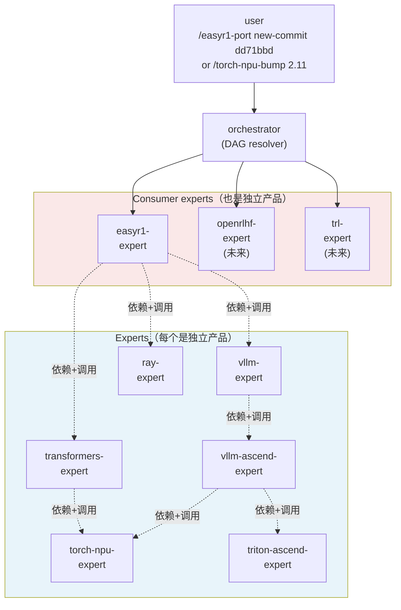
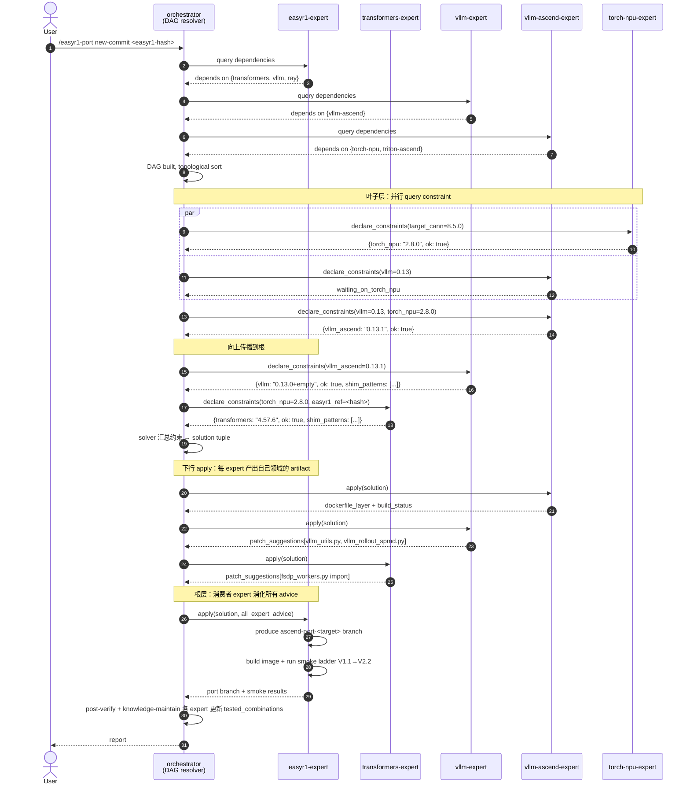

# NPU 移植生态目标架构 + 演进路径 (V2.0)

> 状态：2026-04-22，V2.0。替换 V1.0（照抄 a5_ops kernel-pipeline）。V1.0 的错误是把我们的问题（多上游 DAG 升级协调）当成 kernel 生成的线性 pipeline 问题。V2.0 从 DAG + per-dep expert 模型出发。
>
> V1.0 草稿保留 git 历史（`0664095..89b2530`），供对比。
>
> **核心洞察**（用户 2026-04-22 01:04 + 01:06）：
> 1. 我们的复杂度来自**一个版本升级级联多个依赖升级**，不是单一 op 从 analyze 到 verify
> 2. **每个主要依赖应有自己的专家（skill + agent）独立处理**
> 3. 升级按**依赖树 / DAG 叶子到根**逐节点解决
> 4. DAG 不是严格树，有并行有串行
> 5. **每个 expert 拿出来都是独立产品**（e.g. `torch-npu-expert` 可独立用于"把最新 pytorch 跑到 NPU"场景，不局限服务 easyr1-npu）

---

## 0. 文档导航

| Domain 文档 | 职责 | 状态 |
|---|---|---|
| 本文 `docs/design/SKILLS_ARCH_TARGET.md` | 总体架构 + 演进路径 + phase 计划 | V2.0 draft |
| `docs/design/EXPERT_CONTRACT.md` | Expert 产品契约：输入 / 输出 schema / constraint 声明格式 | Phase 1 产出 |
| `docs/workflow/orchestrator_state_machine.yaml` | Orchestrator 的 DAG 构建 + 调度 state machine | Phase 2 产出 |
| `docs/workflow/WORKFLOW_CRITIC_DESIGN.md` | Critic hook 详细设计、SKILL↔YAML 双绑 | Phase 2 产出 |
| `src/experts/<dep-name>/` | 每个 expert 的 skill + agent + KB + scripts + tested_combinations | Phase 2-4 逐个产出 |

**正交性原则**：本文描述 **"是什么 / 为什么 / 怎么演进"**；domain docs 描述 **"怎么运行 / 怎么强制 / 某 expert 具体长什么样"**。

---

## 1. 这个系统做什么

**产品（复数）**：一组**独立可用的 NPU-dep-expert**，每个 expert 负责**把一个主流上游依赖（torch / vllm / transformers / ray / triton）往 Ascend NPU 方向适配**。每个 expert 自己就是交付物。

**核心 use case** 举例（每条是独立产品）：
- "把最新 pytorch 跑到 NPU 上" → `torch-npu-expert` （即 torch_npu 升级专家）
- "让 vllm 0.20 跟 vllm-ascend 协同" → `vllm-ascend-expert`
- "transformers 5 的 NPU 兼容性" → `transformers-expert`
- "Ray 2.x + NPU 资源" → `ray-expert`
- "triton-ascend 跟上 upstream triton 版本" → `triton-ascend-expert`
- "EasyR1 在 NPU 跑"（消费上面一组 expert）→ `easyr1-expert`

**EasyR1 移植 = `easyr1-expert` 作为 orchestrator，消费其他 expert 的 constraint + advice 产出 port 代码 + image + smoke 验证**。

**关键结构**：这不是 "easyr1-npu + 它的 skills"，而是 **"一组独立 expert + 一个 easyr1-expert 消费者 + 一个 orchestrator 连接他们"**。

---

## 1.1 产品身份：每个 expert 独立交付

### 1.1.1 Expert 是独立产品

每个 expert 的评价不基于 "它让 easyr1-expert 跑通了"，而是 **"它能独立完成它那个 dep 的 NPU 适配任务"**。

举例 `torch-npu-expert` 的独立 use case：
- 用户："我想把 pytorch 2.11（新 release）跑到 NPU 上" → 调 `torch-npu-expert`
- Expert 输入：pytorch 版本 + NPU 平台（CANN 版本、芯片型号）
- Expert 工作：查 CANN↔torch_npu 兼容表 → 找对应 torch_npu branch → build → 跑最小 import 测试 → 出报告
- Expert 产出：(a) "torch_npu 2.11.x 在 CANN 8.5.1 上可用" constraint declaration + (b) build 指令 / Dockerfile layer
- **不要求** easyr1-expert 在场

**评价标准**：另一个项目（不是 easyr1-npu）的 agent / 工程师调用 `torch-npu-expert`，能否冷启动完成 torch_npu 升级任务。

### 1.1.2 消费者是独立产品

`easyr1-expert` 是**消费者型 expert**：
- 自己的产品 = "EasyR1 跑在 NPU"
- 实现方式 = orchestrator 调用一组底层 expert（torch-npu / vllm-ascend / transformers / ray 等），把它们的 constraint + advice 汇总，生成 `ascend-port` 分支
- **不持有** torch-npu / vllm-ascend 等的知识 — 那是各自 expert 的 KB

未来新 RL 框架移植（OpenRLHF / TRL）是另一个消费者 expert（`openrlhf-expert`），它**不用重新学** torch-npu / vllm-ascend 的知识，直接调已有 expert。

### 1.1.3 产品质量三维度（沿用 V1.0）

每个 expert 自己都对这三项负责：

| 维度 | 含义 | 检查位置 |
|---|---|---|
| **Functional** | Expert 声称的 constraint / apply 在真实环境能用 | Expert 内部 smoke + 下游消费者反馈 |
| **Numerical fidelity**（适用时） | 跑 smoke 数值在 baseline ±N% | Expert 的 smoke_validate 脚本 |
| **Provenance** | 每个 artifact 的 producer 明确（expert / human-intervention） | Stop hook + critic |

---

## 2. 目标架构

### 2.1 DAG 驱动的消费者-专家模型

**传统 pipeline (a5_ops kernel-gen)**：单线程 A→B→C→D，适合"生产一件东西"

**我们的模型**：DAG 里多个节点并行/串行，每节点是独立专家，适合"协调一组东西"



**关键点**：
- Expert 之间通过 **declared dependencies** 形成 DAG（expert 自己报它依赖谁）
- Orchestrator 做 **constraint propagation**（SAT solver 类模型）
- 叶子节点（CANN 层）固定、根节点（消费者）启动请求
- 并行：同层无依赖的 expert 并行；串行：有依赖的等前置 done

### 2.2 一次 EasyR1 new-commit 升级的端到端时序



### 2.3 Expert 的标准形态

每个 expert 有一致的目录结构（便于独立仓拆分）：

```
<expert-name>/
├── README.md                          # 独立产品的对外介绍
├── SKILL.md                           # Skill 定义（给 Claude Code / orchestrator 调用）
├── agent.md                           # Agent 定义（phases + Stop hook）
├── state_machine.yaml                 # 内部 workflow（如果 expert 有自己的多阶段）
├── references/                        # 该 dep 的 KB（版本兼容表、常见 bug、API 变动）
│   ├── ALWAYS_LOADED_RULES.md
│   ├── KB_INDEX.md
│   ├── ERROR_CORRECTIONS.md
│   ├── VERSION_COMPAT.md              # 核心：版本兼容矩阵
│   └── patterns/
├── scripts/                           # Expert 专属脚本
│   ├── declare_constraints.py         # 给定输入返回 constraint
│   ├── apply.py                       # 给定 solution 产出 artifact
│   ├── smoke_validate.sh              # Expert 内部最小验证
│   └── ...
├── tested_combinations.yaml           # 已知 working tuple 存档
└── hooks/                             # Expert agent 的 Stop hook
    └── check_expert.sh
```

### 2.4 Expert 之间的合约（EXPERT_CONTRACT.md）

**每个 expert 对外暴露 3 个动作**：

```python
# 动作 1：声明依赖（构建 DAG 用）
def declare_dependencies() -> list[ExpertName]: ...

# 动作 2：声明 constraint
def declare_constraints(
    context: dict,  # orchestrator 提供：上游 expert 已解出的版本、用户 target
) -> Constraint: ...
# Constraint 可以是 "我必须要 dep X 是版本 Y"、"在这个版本下我可用"、"不兼容"

# 动作 3：apply
def apply(solution: dict) -> Artifact: ...
# Artifact 可以是：dockerfile layer、代码 patch suggestions、build script、test report
```

**消费者 expert 多一个动作**：

```python
def integrate(solution: dict, expert_advice: dict) -> PortBranch: ...
# 根据所有底层 expert 的 apply 结果，产出自己的 port 代码 / 分支
```

**合约层严格 schema 化**（Phase 1 的 EXPERT_CONTRACT.md 要固定）。

### 2.5 Orchestrator 的职责（专一）

**不** 持有任何 dep 的知识。只做：

1. **DAG construction**：call `declare_dependencies` 跨 expert 构建 DAG
2. **Constraint solving**：Topological traverse 叶子→根，每节点 call `declare_constraints`，汇总到 solution tuple
3. **Scheduling**：并行化（无依赖的 expert 并发），串行化（有依赖的等待）
4. **Critic hook**：运行时强制 G1-G6 invariants
5. **Artifact coordination**：把 expert A 的 output 喂给 expert B 的 input
6. **Post-verify + commit + knowledge-maintain**：最终聚合

### 2.6 KB 层次：每个 expert 自己的

**V1.0 的错误**：我设计了一个大 `src/skills/references/` 统一 KB。

**V2.0 正解**：每个 expert 有**自己的 KB**。

| KB 位置 | 持有什么 |
|---|---|
| `torch-npu-expert/references/VERSION_COMPAT.md` | CANN ↔ torch 版本映射表 |
| `vllm-ascend-expert/references/VERSION_COMPAT.md` | vllm-ascend ↔ vllm ↔ torch_npu 映射 |
| `transformers-expert/references/NPU_SHIM_PATTERNS.md` | transformers 在 NPU 上常用 shim 模式 |
| `easyr1-expert/references/CODE_PATH_PATTERNS.md` | EasyR1 特有的 CUDA-only callsite |
| `orchestrator/references/DAG_INVARIANTS.md` | G1-G6 跨 expert 全局约束 |

**共享 KB**（少量）：orchestrator 持有的全局规则 + shared types schema。

### 2.7 Hook / Critic 三层

| Layer | Scope | 管什么 |
|---|---|---|
| Expert agent Stop hooks | 单 expert 单 agent | Expert 自己产物合法（schema / provenance / 内部 check） |
| Expert workflow critic (optional per-expert) | 单 expert 内部多阶段 | Expert 内部 state machine invariants |
| **Orchestrator workflow critic** | 全局 DAG | G1-G6：expert 之间的 constraint 一致性、provenance 跨 expert 追踪、cycle detection、版本冲突 |

---

## 3. 当前状态（as-of 2026-04-22）

### 3.1 仓布局现状

```
easyr1-npu/
├── docs/, skills/*, scripts/*, knowledge/, src/scripts/static_check.py (Phase 1 前的 V1.0 produce)
└── （无 expert 目录、无 orchestrator、无 constraint solver）
```

### 3.2 能力盘点

能力矩阵（每行一个目标场景，列是我们是否能做）：

| 场景 | 支持？ | 说明 |
|---|---|---|
| 路径 1：用现有 ascend-port 在 A3 跑 smoke | ✅ Cold-reproducible（round 1 agent 证明） | PORT-GUIDE 5 步 |
| 路径 2：给新 EasyR1 commit 产 port | 🟥 Agent round 2 产码有 syntax 错，不跑 smoke | skill 是 playbook 不是 pipeline |
| **"把新 pytorch 跑到 NPU 上" 独立场景** | 🟥 **完全不支持** | 没有 torch-npu-expert |
| **"让 vllm 0.20 在 NPU 可用" 独立场景** | 🟥 **完全不支持** | 没有 vllm-ascend-expert |
| "transformers 新版 NPU 兼容" 独立场景 | 🟥 **完全不支持** | 没有 transformers-expert |
| 多依赖协调升级（跨 expert DAG） | 🟥 **完全不支持** | 没有 orchestrator |

### 3.3 可以复用的现有资产

V1.0 写出来的一些东西还能复用（不丢）：

- `src/scripts/static_check.py`（Phase 1 前的 static 检查脚本）—— 改挪到 orchestrator 公共 scripts 或 easyr1-expert 里
- `docs/workflow/port_state_machine.yaml`（V1.0 画的 state machine）—— **不复用**，V2.0 下 orchestrator 是 DAG 不是 state machine；但可作为"easyr1-expert 内部的 state machine"参考
- `skills/{dep-gap-detect, npu-code-path-sweep, inspect-ascend-image, run-npu-container, ray-npu-shim, ...}` —— **大部分应该归属到对应 expert**：
  - `dep-gap-detect` → 搬到 `easyr1-expert`（消费者 gap 检查）或独立为 `dep-gap-expert`
  - `inspect-ascend-image` → 工具脚本，`orchestrator/scripts/`
  - `ray-npu-shim` → 搬到 `ray-expert`
  - `npu-code-path-sweep` → 搬到 `easyr1-expert`（EasyR1 特有的 callsite scan）
- `knowledge/{npu-patterns, upstream-refs, images, ...}` —— 拆到各 expert KB
- `scripts/run-npu-container.sh` → `easyr1-expert/scripts/`（因为只服务消费者）或拆一个 `a3-runtime-expert`

### 3.4 NPU-OPS-010 教训（不能再违反）

Round 2 agent 产码有 syntax 错 + 不跑 smoke 的事实。**V2.0 任何 expert 产出的代码必须通过内部 Stop hook 的 static_check + smoke；orchestrator 的 G2 invariant 跨 expert 再强制一次**。

---

## 4. Gap 分析

| # | Gap | 严重度 | Phase |
|---|---|---|---|
| 1 | 没有 expert 这个抽象层（当前只是一堆 skill 和脚本） | HIGH | Phase 1：定义 EXPERT_CONTRACT.md |
| 2 | 没有 orchestrator（DAG + solver） | HIGH | Phase 2 |
| 3 | 各 dep 的 KB 没独立，分散在 `knowledge/` | MEDIUM | Phase 3：按 expert 重新组织 |
| 4 | 没有 `tested_combinations.yaml` 机制（已知 working tuple） | MEDIUM | Phase 2（作为 expert 模板的一部分） |
| 5 | Agent 产码无 syntax/import 验证（NPU-OPS-010） | HIGH | Phase 1：Stop hook 强制 |
| 6 | Agent 不自己上 A3 跑 smoke | HIGH | Phase 2：consumer expert 的 `integrate` 动作包含这个 |
| 7 | 没有 provenance 追踪跨 expert | HIGH | Phase 1：合约里 artifact 标 `produced_by` 字段 |
| 8 | 没有 SKILL ↔ YAML 双绑 | MEDIUM | Phase 1：pre-commit hook |
| 9 | 现有 skills 单独存在，没有归属 expert | LOW | Phase 3：搬迁 |
| 10 | 没有 knowledge-maintain（跨 expert 共享新发现） | LOW | Phase 4 |
| 11 | HANDOVER/porting-journal 对 agent 可见（作弊源） | LOW | Phase 4：物理隔离 reproduction-kit |

---

## 5. 演进路径

### 原则

- **每个 Phase 有 concrete acceptance test**（不是"文档写完"）
- **先做 2 个 expert 完整走通**（torch-npu + easyr1 或 vllm-ascend + easyr1），而不是一次做所有 expert
- **Orchestrator 先做最小 version**，验证 DAG + solver 概念
- **cold-drive 测试每 phase 后必做**
- 每个 Phase 结束，可以**选择独立发布** expert（比如 Phase 2 完了 `torch-npu-expert` 就可以单独用于 pytorch 升级场景）

### Phase 1 — 合约 + 机械强制（1-2 天）

**目标**：定义 expert 产品的标准合约；让任何 expert 产码都不能有 SyntaxError；跨 expert 的 provenance 可追踪。

**交付物**：
- `docs/design/EXPERT_CONTRACT.md`：expert 的 3 个动作 schema（declare_dependencies / declare_constraints / apply）+ 消费者的 integrate
- `docs/design/DAG_INVARIANTS.md`：G1-G6 跨 expert 规则（从 port_state_machine.yaml 改造）
- `src/scripts/static_check.py`（保留，作为 expert 公共脚本）
- `src/scripts/provenance_lint.py`：检查 artifact 的 produced_by 字段合法
- `.claude/hooks/PreToolUse/block_orchestrator_edit_consumer_code.sh`（G1）
- `.claude/hooks/Stop/check_expert_static_pass.sh`（G2）

**Acceptance**：
- **T1.1**：新写一个 toy expert `src/experts/hello-expert/`，能 declare_dependencies() + declare_constraints() 返回合法 schema，被 lint 工具通过
- **T1.2**：人为在 expert 产物里放 SyntaxError，Stop hook 必须拦截
- **T1.3**：Orchestrator 试图直接 Edit 消费者 expert 的 port code，PreToolUse hook 拦截

### Phase 2 — 2 个 expert 最小闭环（5-7 天）

**目标**：写出 **`torch-npu-expert`** + **`easyr1-expert`** 两个 expert，加一个最小 orchestrator，跑通一次 end-to-end：用户调 `/easyr1-port reproduce v1`，orchestrator 调两个 expert，产出可跑 V1.1 smoke 的 image。

**为什么先这俩**：torch_npu 是最底层（叶子侧），easyr1 是根。两者走通了 = 证明 DAG + solver 概念 work，后续加 vllm-ascend/transformers 是 same pattern 复制。

**交付物**：
- `src/experts/torch-npu-expert/`（完整目录：SKILL.md + agent.md + state_machine.yaml + references/ + scripts/ + tested_combinations.yaml + hooks/）
- `src/experts/easyr1-expert/`（完整目录，consumer 版）
- `src/orchestrator/`（skill + DAG builder + constraint solver + scheduler）
- `docs/workflow/orchestrator_state_machine.yaml`

**Acceptance**：
- **T2.1**：冷启动 agent 调 `/torch-npu-bump 2.8 --cann 8.5.0`，torch-npu-expert 自己能产出 "torch_npu 2.8.0 可用，这是 build layer" 报告（不需要 easyr1 在场）
- **T2.2**：冷启动 agent 调 `/easyr1-port reproduce v1`，orchestrator 构建 DAG → 调 torch-npu-expert → 调 easyr1-expert → 产出可跑 V1.1 smoke 的 image，V1.1 PASS
- **T2.3**：人为破坏 torch-npu-expert 的 declare_constraints（返回矛盾约束），orchestrator 的 solver 必须报错中止，不放行
- **T2.4**：agent 的整个运行里，provenance 表清晰标注每个 artifact 的 producer；没有 human-intervention

### Phase 3 — 补齐其他 expert（3-5 天）

**目标**：把现有 ascend-port 的能力拆到剩余 expert。

**交付物**：
- `src/experts/vllm-ascend-expert/`
- `src/experts/vllm-expert/`
- `src/experts/transformers-expert/`
- `src/experts/triton-ascend-expert/`
- `src/experts/ray-expert/`
- 每个 expert 包含迁移过来的 KB（从 `knowledge/npu-patterns.md` 按 category 拆）
- 每个 expert 的 `tested_combinations.yaml` 填入当前 v1/v2 image 验证过的 tuple

**Acceptance**：
- **T3.1**：`/easyr1-port reproduce v1` 完整跑 V1.1 → V2.2 ladder 全绿
- **T3.2**：独立跑 `/transformers-bump 5.3 --npu` 能独立产 report（证明 expert 独立性）
- **T3.3**：每个 expert 的 `tested_combinations.yaml` 能被 orchestrator 查询到选可行组合

### Phase 4 — 真正冷启动复现 + 对外发布（2-3 天）

**目标**：证明整个产品能被客户用。

**交付物**：
- 每个 expert 可独立 git-extract 到自己的 gitcode 仓（保留 monorepo，但每个 expert 目录自包含）
- `docs/CUSTOMER-GUIDE.md`：外部用户如何调这些 expert
- Round 3 cold-drive 测试：fresh agent 完整跑通 `/easyr1-port new-commit <hash>`
- Retrospective artifact：round 3 数据 + 和 round 1/2 对比（skill effectiveness 升级证据）

**Acceptance**：
- **T4.1**：Round 3 agent，在 < 2h 内，产出 CLOSED 状态的 port（无 human-intervention artifact）
- **T4.2**：把 torch-npu-expert 拆到独立 gitcode 仓测，另一个场景（不是 easyr1）能复用
- **T4.3**：Codex review 本设计 + acceptance 结果，无 CRITICAL 级 issue

### Phase 5 — 多 consumer expert（未来）

- `src/experts/openrlhf-expert/`（另一个消费者）
- 证明加新消费者 = 0 改动 orchestrator + 0 改动底层 expert
- 不阻塞 Phase 4 的对客发布

---

## 6. 保持 / 改 / 新增

**保持**：
- 所有现有 `docs/`、`knowledge/`、`scripts/` 不删；`knowledge/*.md` Phase 3 时拆到 expert，原件可作为迁移前 reference 在 `docs/archive/`
- 现有 `skills/*/SKILL.md` 作为 Phase 3 迁移来源（不独立存在；归到 expert）
- `porting-journal.md` / `HANDOVER.md` / `NPU-OPS-010`（继续 append）

**改**：
- README 路径说明：加**第 5 个入口**——"独立用单个 expert"（不只是 easyr1 场景）
- `install-skills.sh` 升级：支持 `--expert <name>` 仅装单个 expert

**新增**：
- `src/experts/*`, `src/orchestrator/`, `docs/design/EXPERT_CONTRACT.md`, `docs/workflow/orchestrator_state_machine.yaml`, `.claude/hooks/`, Phase 4 的 `CUSTOMER-GUIDE.md`

---

## 7. 已知债务

- V1.0 的 `port_state_machine.yaml` 是 easyr1 单产品视角，不适合 V2.0；保留作为 easyr1-expert 内部 state machine 参考
- Round 2 的 ascend-port-e2e-round2 分支有 SyntaxError，Phase 1 完成后重跑 round 3 会用 hook 拦住
- A3 build 因 huaweicloud mirror 慢卡死：Phase 2 的 expert Dockerfile 必须用可靠 mirror + timeout
- cold-drive 闭环 0 次成功（round 1 作弊，round 2 不跑 smoke）—— Phase 4 的 T4.1 是首次真闭环

---

## 8. 下一步

**等 user 审批**：
1. DAG + per-dep expert 模型方向对吗？
2. Phase 1 先定合约 + 机械 hook，Phase 2 先做 torch-npu + easyr1 两个 expert，这个起手顺序合理吗？
3. Acceptance T1-T4 够严吗？
4. monorepo 阶段 OK，还是一上来就独立仓？

批准后 Phase 1 开工（1-2 天）。
